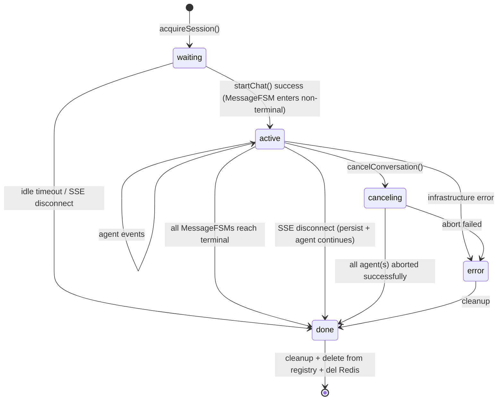
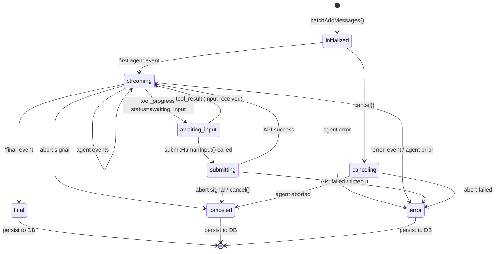

# Chat 后端状态机重构设计

> 日期：2026-03-28
> 状态：已批准
> 更新：Multi-Agent 并行执行支持

## 设计原则

1. **状态转换是同步事实**：`transition(to): boolean`，永不 async，永不 throw。非法转换返回 `false`，不做任何副作用。所有副作用由调用方或 `onTransition` 回调负责。
2. **副作用归属触发源**：方法调用驱动的副作用留在方法内（如 `cancel()` 中 abort ExecutionContext），事件数据驱动的副作用留在 `handleEvent()` 内（如累积 PendingMessage）。
3. **单一 `onTransition(from, to)` 回调**：替代 per-state 钩子，由 StateMachine 统一管理。SessionFSM 在 `onTransition` 中处理日志 + idle timeout + Redis 持久化；MessageFSM 在 `onTransition` 中通知 SessionFSM 同步聚合状态。
4. **前后端共用 StateMachine**：`src/shared/utils/StateMachine.ts` 提供泛型 `StateMachine<TPhase>`，前端 ConversationFSM / MessageFSM 与后端使用同一实现。

## 共享 StateMachine

```typescript
interface StateMachineOptions<TPhase extends string> {
  initialPhase: TPhase;
  transitions: Record<TPhase, TPhase[]>;
  onTransition?: (from: TPhase, to: TPhase) => void;
}

class StateMachine<TPhase extends string> {
  get phase(): TPhase;
  canTransitionTo(to: TPhase): boolean;
  transition(to: TPhase): boolean; // 同步，非法返回 false
  silentTransition(to: TPhase): boolean; // 不触发 onTransition
}
```

## 背景

早期后端的会话状态由 `ChatSession` 类管理，只有 `waiting → running → done` 三个 phase。ChatSession 同时持有 SSE 连接、phase 状态机、PendingMessage、ExecutionContext，并且自己驱动 agent 执行循环（`run()`）。这种粗粒度设计导致：

1. Chat 和 agent 调用不隔离，非 SSE 场景（定时任务）无法复用
2. 缺少 `awaiting_input` / `error` 状态，human-in-the-loop 与 session 脱节
3. 僵尸检测逻辑耦合在 `acquireSession` 的分布式锁内
4. Agent 执行循环与连接管理混在一起
5. 单 MessageFSM 设计，无法支持多消息并发
6. ExecutionContext 创建在 `runSession` 中，取消时无法 abort 正在等待的 agent loop

## 设计目标

1. 两层级状态机：会话层（连接生命周期）+ 消息层（消息生命周期），前后端对齐
2. Agent 执行循环从 ChatSession 移出，通过事件回调驱动 FSM
3. 僵尸检测逻辑独立于 session 创建流程
4. Redis 存储 session phase + message phase，服务器重启可恢复更多状态
5. 支持多消息并行执行，消息级 abort 控制
6. 事件携带 messageId，前端可精确路由到对应消息

## 分层概念

```
┌─────────────────────────────────────────────────────────────┐
│                      SessionFSM                              │
│  会话层：管理 SSE 连接生命周期，聚合消息状态                  │
│  phase: waiting | active | canceling | error | done          │
│  内部持有: StateMachine<SessionPhase>                        │
└─────────────────────────────────────────────────────────────┘
                              │
                              │ Map<messageId, MessageFSM>
                              ▼
┌─────────────────────────────────────────────────────────────┐
│                      MessageFSM                              │
│  消息层：管理单条消息的生命周期                               │
│  phase: initialized | streaming | awaiting_input | ...       │
│  持有：ExecutionContext, PendingMessage                      │
│  内部持有: StateMachine<MessagePhase>                        │
└─────────────────────────────────────────────────────────────┘
                              │
                              │ ctx: ExecutionContext
                              ▼
┌─────────────────────────────────────────────────────────────┐
│                    ExecutionContext                          │
│  执行上下文：服务于 agent loop，与场景无关                    │
│  - 对话场景：由 MessageFSM 创建和持有                         │
│  - 非对话场景（定时任务等）：独立创建使用                     │
└─────────────────────────────────────────────────────────────┘
```

**ExecutionContext 是通用概念**，服务于任何 agent loop 执行场景。MessageFSM 在对话场景下持有它，因为一条消息对应一次 agent 执行。非对话场景（如定时任务）直接创建 ExecutionContext 使用，不经过 MessageFSM。

## 1. 会话层状态机 SessionFSM

SessionFSM 替换当前 ChatSession，管理 SSE 连接生命周期和 Redis 状态持久化。内部持有 `StateMachine<SessionPhase>` 实例，构造时通过 `onTransition` 统一处理日志、idle timeout 清除和 `onPhaseChange` 回调。

### 状态定义

| 状态        | 是否终态 | 含义                                           |
| ----------- | -------- | ---------------------------------------------- |
| `waiting`   | 否       | SSE 已连接，无活跃消息。idle timeout 后 → done |
| `active`    | 否       | 至少有一个 MessageFSM 处于非终态               |
| `canceling` | 否       | 收到 cancel 请求，正在 abort agent             |
| `error`     | 否       | 不可恢复的错误（可重连恢复）                   |
| `done`      | 是       | 正常终态，触发 cleanup                         |

### 状态转换图



### 核心接口

```typescript
type SessionPhase = 'waiting' | 'active' | 'canceling' | 'error' | 'done';

interface SessionFSMOptions {
  idleTimeoutMs: number;
  onDispose: (conversationId: string) => Promise<void>;
  onPhaseChange?: (
    conversationId: string,
    phase: SessionPhase,
  ) => Promise<void>;
}

class SessionFSM {
  readonly conversationId: string;
  phase: SessionPhase; // 来自内部 StateMachine<SessionPhase>

  bindConnection(connection: SSEConnection): void;
  addMessageFSM(msgId: string, pendingMessage: PendingMessage): MessageFSM;
  getMessageFSM(messageId: string): MessageFSM | undefined;
  cancelMessage(messageId: string): void;
  cancelAllMessages(reason: string): void;
  handleDisconnect(): Promise<void>;
  send(event: AgentEvent): boolean;
  cleanup(): Promise<void>; // async: 调用 onDispose 回调
}
```

### StateMachine 构造与 onTransition

```typescript
constructor(conversationId: string, options: SessionFSMOptions) {
  this.sm = new StateMachine({
    initialPhase: 'waiting',
    transitions: VALID_TRANSITIONS,
    onTransition: (_from, to) => {
      if (to !== 'waiting') clearTimeout(this.idleTimeout);
      logger.info(`Session phase changed: ${_from} -> ${to}`, {
        sessionId: this.conversationId,
      });
      this.options.onPhaseChange?.(this.conversationId, to);
    },
  });
}
```

`onTransition` 是同步的，但其中的 `onPhaseChange` 回调返回 `Promise<void>`（用于 Redis 持久化），由调用方以 fire-and-forget 方式触发（`cleanup()` 内直接 await）。

### onMessagePhaseChange（同步）

`onMessagePhaseChange` 由 MessageFSM 的 `onTransition` 回调触发，是同步方法。它聚合所有 MessageFSM 状态来驱动 SessionFSM 的 phase 转换：

| MessageFSM 变化                                | SessionFSM 变化    | Redis 更新              |
| ---------------------------------------------- | ------------------ | ----------------------- |
| 任一 MessageFSM 进入非终态                     | `waiting → active` | phase + add to messages |
| 最后一个 MessageFSM 到达终态                   | `active → waiting` | phase + clear messages  |
| `canceling → canceled`（全部 MessageFSM 终态） | `canceling → done` | del                     |
| 任一 → `error`（且无其他活跃 MessageFSM）      | `active → error`   | phase + update messages |

```typescript
private onMessagePhaseChange(
  _messageId: string,
  _from: MessagePhase,
  _to: MessagePhase,
): void {
  const hasActive = Array.from(this.messageFSMs.values()).some(
    fsm => !fsm.isTerminated,
  );

  if (hasActive && this.phase === 'waiting') {
    this.sm.transition('active');
  } else if (!hasActive && this.phase === 'active') {
    this.sm.transition('waiting');
  } else if (!hasActive && this.phase === 'canceling') {
    this.cleanup().catch(err =>
      logger.error(`Failed to cleanup after cancel:`, err),
    );
  }
}
```

### cleanup()

`cleanup()` 是唯一的 async 方法，因为它需要执行 `onDispose` 回调（Redis 清理、DB 持久化等）：

```typescript
async cleanup(): Promise<void> {
  clearTimeout(this.idleTimeout);
  this.sm.transition('done');

  this.sseConnection?.close();
  this.sseConnection = null;
  this.messageFSMs.clear();

  await this.options.onDispose(this.conversationId);
}
```

## 2. 消息层状态机 MessageFSM

管理单条助手消息的完整生命周期，通过事件回调驱动状态转换。内部持有 `StateMachine<MessagePhase>` 实例。

### 状态定义

| 状态             | 是否终态 | 含义                             |
| ---------------- | -------- | -------------------------------- |
| `initialized`    | 否       | 消息已创建到 DB，等待 agent 开始 |
| `streaming`      | 否       | 正在接收 agent 事件              |
| `awaiting_input` | 否       | Agent 等待用户输入               |
| `submitting`     | 否       | submitHumanInput API 飞行中      |
| `canceling`      | 否       | 收到 cancel 请求                 |
| `final`          | 是       | 正常完成                         |
| `canceled`       | 是       | 已取消                           |
| `error`          | 是       | 错误                             |

### 状态转换图



### 核心接口

```typescript
type MessagePhase =
  | 'initialized'
  | 'streaming'
  | 'awaiting_input'
  | 'submitting'
  | 'canceling'
  | 'final'
  | 'canceled'
  | 'error';

interface MessageFSMOptions {
  onTransition?: (
    messageId: string,
    from: MessagePhase,
    to: MessagePhase,
  ) => void;
}

class MessageFSM {
  readonly messageId: string;
  phase: MessagePhase; // 来自内部 StateMachine<MessagePhase>
  readonly executionContext: ExecutionContext;

  constructor(
    messageId: string,
    pendingMessage: PendingMessage,
    options?: MessageFSMOptions,
  );

  get ctx(): ExecutionContext;
  get isTerminated(): boolean;

  handleEvent(event: AgentEvent): void;
  cancel(): void;
  persist(): Promise<void>;
}
```

### StateMachine 构造与 onTransition

```typescript
constructor(messageId: string, pendingMessage: PendingMessage, options?: MessageFSMOptions) {
  this.messageId = messageId;
  this.pendingMessage = pendingMessage;
  this.options = options;
  this.executionContext = new ExecutionContext(
    new AbortController(),
    messageId,
  );

  this.sm = new StateMachine({
    initialPhase: 'initialized',
    transitions: VALID_TRANSITIONS,
    onTransition: (from, to) =>
      options?.onTransition?.(messageId, from, to),
  });
}
```

### handleEvent() 与 cancel() — 同步转换

`handleEvent()` 和 `cancel()` 均通过 `sm.transition()` 同步执行状态转换，不做 async 操作。非法转换静默返回 `false`。

```typescript
handleEvent(event: AgentEvent): void {
  if (this.isTerminated) return;

  this.pendingMessage.handleEvent(event);

  switch (event.type) {
    case 'start':
    case 'stream':
    case 'thought':
    case 'tool_call':
      if (this.phase === 'initialized' || this.phase === 'submitting') {
        this.sm.transition('streaming');
      }
      break;

    case 'tool_progress': {
      if (this.phase === 'initialized' || this.phase === 'submitting') {
        this.sm.transition('streaming');
      }
      const data = event.data as { status?: string } | undefined;
      if (data?.status === 'awaiting_input') {
        this.sm.transition('awaiting_input');
      }
      break;
    }

    case 'final':
      this.sm.transition('final');
      break;

    case 'error':
      this.sm.transition('error');
      break;
    // ...
  }
}

cancel(): void {
  if (this.isCanceling || this.isTerminated) return;

  this.executionContext.abort('Cancelled by user');

  this.sm.transition('canceling') || this.sm.transition('canceled');
}
```

### 消息内容累积

PendingMessage 保留，作为消息内容累积的载体。MessageFSM 持有 PendingMessage，在 `handleEvent` 时：

1. 委托 PendingMessage 累积 content / events
2. 通过 `sm.transition()` 更新 phase（同步）
3. `onTransition` 回调通知 SessionFSM 同步聚合状态

## 3. 会话与 Agent 执行流程

### 流程图

```
┌─────────────────────────────────────────────────────────────────────┐
│ 1. 前端 SSE 连接                                                     │
│    GET /api/chat/sse/:conversationId                                 │
│    → ChatController.initSSE()                                        │
│    → ChatService.acquireSession()                                    │
│    → SessionFSM 创建 (phase: waiting)                                │
└─────────────────────────────────────────────────────────────────────┘
                                    │
                                    ▼
┌─────────────────────────────────────────────────────────────────────┐
│ 2. 前端发起聊天                                                      │
│    POST /api/chat/start/:conversationId                              │
│    → ChatController.chat()                                           │
│      → 创建 assistant message (messageId)                            │
│      → 返回 messageId 给前端                                         │
│      → session.addMessageFSM(messageId, pendingMessage)              │
│        → MessageFSM 创建 (含 ExecutionContext)                       │
│        → MessageFSM.onTransition → SessionFSM.onMessagePhaseChange   │
│        → SessionFSM: waiting → active (同步)                         │
│      → ChatService.runSession()                                      │
└─────────────────────────────────────────────────────────────────────┘
                                    │
                                    ▼
┌─────────────────────────────────────────────────────────────────────┐
│ 3. Agent 执行                                                        │
│    runSession(session, agent, memory, config, messageId)             │
│      → messageFSM = session.getMessageFSM(messageId)                 │
│      → agent.call(memory, messageFSM.ctx, config)                    │
│      → for await (event of ...) {                                    │
│          → 事件携带 messageId                                         │
│          → messageFSM.handleEvent(eventWithMessageId)                │
│            → sm.transition() 同步更新 phase                           │
│            → onTransition 通知 SessionFSM                            │
│          → session.send(eventWithMessageId)                          │
│        }                                                             │
└─────────────────────────────────────────────────────────────────────┘
                                    │
                                    ▼
┌─────────────────────────────────────────────────────────────────────┐
│ 4. 取消                                                              │
│    POST /api/chat/cancel/:conversationId/:messageId                  │
│    → ChatController.cancelMessage()                                  │
│    → session.getMessageFSM(messageId).cancel()                       │
│    → MessageFSM.cancel()                                             │
│      → executionContext.abort()                                      │
│      → sm.transition('canceling') (同步)                             │
│    → agent loop 检测 signal.aborted 并退出                           │
└─────────────────────────────────────────────────────────────────────┘
```

### runSession 实现

```typescript
async runSession(session, agent, memory, config, messageId) {
  const messageFSM = session.getMessageFSM(messageId)!;

  try {
    for await (const event of agent.call(memory, messageFSM.ctx, config)) {
      if (messageFSM.ctx.signal.aborted) break;

      const eventWithMessageId = { ...event, messageId };
      messageFSM.handleEvent(eventWithMessageId);
      session.send(eventWithMessageId);
    }
  } catch (err) {
    // handle error
  } finally {
    await messageFSM.persist();
  }
}
```

## 4. 取消语义

### 会话级取消 vs 消息级取消

| 维度    | 会话级 `cancelConversation()`  | 消息级 `cancelMessage(id)`            |
| ------- | ------------------------------ | ------------------------------------- |
| API     | `POST /cancel/:conversationId` | `POST /cancel/:conversationId/:msgId` |
| 范围    | 所有活跃 MessageFSM            | 指定 MessageFSM                       |
| SSE     | 不关闭（其他消息可能还需要）   | 不关闭                                |
| Session | 全部 MessageFSM 终态后 → done  | 不影响 Session phase                  |

### 消息级取消流程

```
ChatController.cancelMessage()
  → session.getMessageFSM(msgId)?.cancel()
  → MessageFSM.cancel()
    → executionContext.abort()
    → sm.transition('canceling') (同步)
  → agent loop 检测 signal.aborted → 退出
  → sm.transition('canceled') (同步)
  → onTransition → SessionFSM.onMessagePhaseChange() (同步)
    → 若还有其他活跃消息：保持 active
    → 若全部终止：active → waiting
```

## 5. 事件携带 messageId

所有 AgentEvent 变体增加 `messageId` 字段，用于前端事件路由：

```typescript
export type AgentEvent =
  | { type: 'start'; messageId: string; seq: number; at: number }
  | {
      type: 'thought';
      messageId: string;
      content: string;
      seq: number;
      at: number;
    }
  | {
      type: 'stream';
      messageId: string;
      content: string;
      seq: number;
      at: number;
    }
  | {
      type: 'tool_call';
      messageId: string;
      callId: string;
      toolName: string;
      toolArgs: Record<string, unknown>;
      seq: number;
      at: number;
    }
  | {
      type: 'tool_progress';
      messageId: string;
      callId: string;
      toolName: string;
      data: unknown;
      seq: number;
      at: number;
    }
  | {
      type: 'tool_result';
      messageId: string;
      callId: string;
      toolName: string;
      output: unknown;
      seq: number;
      at: number;
    }
  | {
      type: 'tool_error';
      messageId: string;
      callId: string;
      toolName: string;
      error: string;
      seq: number;
      at: number;
    }
  | { type: 'final'; messageId: string; seq: number; at: number }
  | {
      type: 'cancelled';
      messageId: string;
      reason: string;
      seq: number;
      at: number;
    }
  | {
      type: 'error';
      messageId: string;
      error: string;
      seq: number;
      at: number;
    };
```

## 6. Redis Keys 与 TraceContext

### Redis Keys

多消息并行场景下，`HUMAN_INPUT` 和 `AGENT_CACHE` 使用 `messageId` 作为 key 的一部分：

```typescript
export const RedisKeys = {
  // 会话级别
  CHAT_SESSION: (conversationId: string) => `chat_session:${conversationId}`,
  CHAT_SESSION_LOCK: (conversationId: string) =>
    `chat_session_lock:${conversationId}`,

  // 消息级别
  HUMAN_INPUT: (messageId: string) => `human_input:${messageId}`,
  AGENT_CACHE: (messageId: string, key: string) =>
    `agent:cache:${messageId}:${key}`,
};
```

### TraceContext

增加 `messageId` 字段，用于工具上下文和日志追踪：

```typescript
export interface TraceStore {
  requestId: string;
  userId?: string;
  conversationId?: string;
  messageId?: string;
  traceId?: string;
  _frozen?: boolean;
}
```

ChatController 在 `startChat` 时设置：

```typescript
TraceContext.update({
  conversationId,
  messageId: assistantMessage.id,
  traceId: assistantMessage.id,
});
```

## 7. 服务器重启恢复

### Redis 状态结构

```typescript
interface MessagePhaseEntry {
  messageId: string;
  phase: MessagePhase;
}

interface ChatSessionState {
  conversationId: string;
  phase: SessionPhase;
  messages: MessagePhaseEntry[];
  startedAt: number;
  agentId: string | null;
}
```

Redis key: `chat_session:{conversationId}`，TTL: 1h。

### 僵尸检测

`detectAndCleanupZombie()` 检测服务器重启后的僵尸会话，标记所有无终态的助手消息为 error。

## 8. 类职责

### SessionFSM

| 职责         | 方法                                                       |
| ------------ | ---------------------------------------------------------- |
| Phase 状态机 | 内部 `StateMachine<SessionPhase>`, `onTransition` 统一回调 |
| SSE 连接管理 | `bindConnection()`, `handleDisconnect()`, `send()`         |
| 消息生命周期 | `addMessageFSM()`, `messageFSMs` Map                       |
| 状态聚合     | `onMessagePhaseChange()` — 同步聚合 MessageFSM 状态        |
| 取消         | `cancelMessage()`, `cancelAllMessages()`                   |
| Redis 持久化 | `onTransition` → `onPhaseChange` 回调                      |
| 清理         | `cleanup()` — async，调用 `onDispose` 回调                 |

### MessageFSM

| 职责         | 方法                                                              |
| ------------ | ----------------------------------------------------------------- |
| Phase 状态机 | 内部 `StateMachine<MessagePhase>`, `onTransition` 通知 SessionFSM |
| 事件处理     | `handleEvent()` — 同步调用 `sm.transition()`                      |
| 取消         | `cancel()` — 同步调用 `sm.transition()`                           |
| 内容累积     | 委托 PendingMessage                                               |
| 执行上下文   | 构造时创建 `ExecutionContext`，`cancel()` 时 abort                |
| DB 持久化    | `persist()`                                                       |

### ChatService

| 职责           | 方法                                               |
| -------------- | -------------------------------------------------- |
| Session 注册表 | `acquireSession()`, `getSession()`, `sessions Map` |
| 僵尸检测       | `detectAndCleanupZombie()`                         |
| Agent 执行编排 | `runSession()` — 使用 MessageFSM.ctx               |
| 构建 Memory    | `buildMemory()`                                    |
| Redis 状态查询 | `getSessionState()`, `updateSessionPhase()`        |

### ChatController

| 职责         | 说明                                    |
| ------------ | --------------------------------------- |
| SSE 连接     | `initSSE()`                             |
| 发起聊天     | `chat()` — 支持多消息并行               |
| 取消         | `cancelChat()`, `cancelMessage()`       |
| TraceContext | 设置 conversationId, messageId, traceId |

## 9. 文件结构

```
src/shared/utils/
└── StateMachine.ts        # 共享泛型状态机（前后端共用）

src/server/core/
├── SessionFSM.ts          # 会话层状态机
├── MessageFSM.ts          # 消息层状态机
├── ExecutionContext.ts    # 执行上下文（通用）
├── PendingMessage.ts      # 内容累积载体
├── SSEConnection.ts       # SSE 连接封装
├── agent/                 # Agent 实现
└── tool/                  # Tool 实现

src/server/service/
├── ChatService.ts         # Agent 执行编排
└── ...

src/server/controller/
├── ChatController.ts      # API 入口
└── HumanInputController.ts
```
