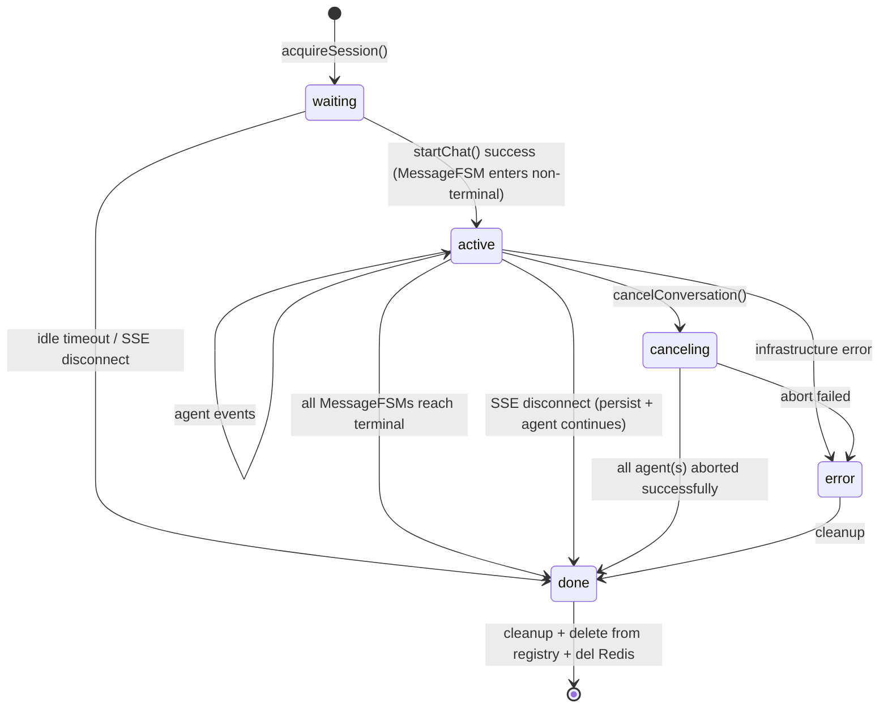
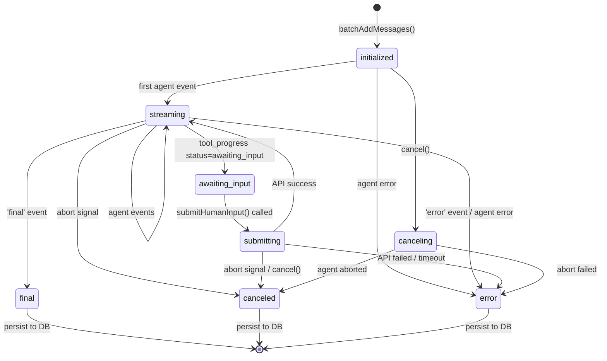

# Chat 后端状态机重构设计

> 日期：2026-03-27
> 状态：已批准

## 背景

当前后端的会话状态由 `ChatSession` 类管理，只有 `waiting → running → done` 三个 phase。ChatSession 同时持有 SSE 连接、phase 状态机、PendingMessage、ExecutionContext，并且自己驱动 agent 执行循环（`run()`）。这种粗粒度设计导致：

1. Chat 和 agent 调用不隔离，非 SSE 场景（定时任务）无法复用
2. 缺少 `awaiting_input` / `error` 状态，human-in-the-loop 与 session 脱节
3. 僵尸检测逻辑耦合在 `acquireSession` 的分布式锁内
4. Agent 执行循环与连接管理混在一起
5. 单 MessageFSM 设计，无法支持多消息并发

## 设计目标

1. 两层级状态机：会话层（连接生命周期）+ 消息层（消息生命周期），与前端对齐
2. Agent 执行循环从 ChatSession 移出，通过事件回调驱动 FSM
3. 僵尸检测逻辑独立于 session 创建流程
4. Redis 存储 session phase + message phase，服务器重启可恢复更多状态
5. 预留多消息扩展（Map 结构），支持会话级 vs 消息级取消

## 1. 会话层状态机 SessionFSM

SessionFSM 替换当前 ChatSession，管理 SSE 连接生命周期和 Redis 状态持久化。与前端 ConversationFSM 对齐，增加 `connected`、`active`、`error` 状态。

### 状态定义

| 状态        | 是否终态 | 含义                                           |
| ----------- | -------- | ---------------------------------------------- |
| `waiting`   | 否       | SSE 已连接，无活跃消息。idle timeout 后 → done |
| `active`    | 否       | 至少有一个 MessageFSM 处于非终态               |
| `canceling` | 否       | 收到 cancel 请求，正在 abort agent             |
| `error`     | 否       | 不可恢复的错误（可重连恢复）                   |
| `done`      | 是       | 正常终态，触发 cleanup                         |

### 状态转换图



### 关键设计决策

**1. connected 不作为后端状态**

前端有 `connecting → connected → active` 三态，后端简化为 `waiting → active`。原因：后端在 `acquireSession` 时已经完成了 SSE 握手（`connected`），之后的 `startChat` 直接让 MessageFSM 进入非终态从而驱动 `waiting → active`。后端不需要 `connected` 这个中间态来区分"在线但无消息"和"有活跃消息"——`waiting` 已经表达了"在线但无消息"的语义。

**2. active ↔ waiting 由 MessageFSM 驱动**

```typescript
private onMessagePhaseChange(msgId: string, phase: MessagePhase): void {
  const hasActive = Array.from(this.messageFSMs.values())
    .some(fsm => !fsm.isTerminal);

  if (hasActive && this.phase === 'waiting') {
    this.transition('active');
  } else if (!hasActive && this.phase === 'active') {
    this.transition('waiting');
  }
}
```

**3. SSE 断开 vs Cancel 的区别**

- **SSE 断开**（`handleDisconnect`）：Agent 继续运行，persist 当前消息，phase 不变。前端可重连。
- **Cancel**：通过 `cancel()` → `canceling` → `done`，Agent 被 abort。

**4. error 状态**

与前端对齐，后端 SessionFSM 也有 `error` 状态。进入 `error` 后可以 cleanup 进入 `done`，也可以通过重连恢复。error 场景包括：基础设施错误、persist 失败等。

**5. 僵尸检测独立于 FSM**

`detectAndCleanupZombie()` 从 `acquireSession` 中抽离，作为 `ChatService` 的独立方法。

### 核心接口

```typescript
type SessionPhase = 'waiting' | 'active' | 'canceling' | 'error' | 'done';

class SessionFSM {
  phase: SessionPhase;
  private sseConnection: SSEConnection | null;
  private messageFSMs: Map<string, MessageFSM>;

  bindConnection(connection: SSEConnection): void;
  addMessageFSM(msgId: string, fsm: MessageFSM): void;
  getMessageFSM(messageId: string): MessageFSM | undefined;
  cancelMessage(messageId: string): void;
  cancelAllMessages(reason: string): void;
  handleDisconnect(): Promise<void>;
  send(event: AgentEvent): boolean;
  cleanup(): Promise<void>;
}
```

## 2. 消息层状态机 MessageFSM

管理单条助手消息的完整生命周期，通过事件回调驱动状态转换。SessionFSM 持有 `Map<messageId, MessageFSM>`，预留多消息扩展。

### 状态定义

| 状态             | 是否终态 | 含义                             |
| ---------------- | -------- | -------------------------------- |
| `initialized`    | 否       | 消息已创建到 DB，等待 agent 开始 |
| `streaming`      | 否       | 正在接收 agent 事件              |
| `awaiting_input` | 否       | Agent 等待用户输入               |
| `submitting`     | 否       | submitHumanInput API 飞行中      |
| `canceling`      | 否       | 收到 cancel 请求                 |
| `final`          | 是       | 正常完成                         |
| `canceled`       | 是       | 已取消                           |
| `error`          | 是       | 错误                             |

### 状态转换图



### 核心接口

```typescript
type MessagePhase =
  | 'initialized'
  | 'streaming'
  | 'awaiting_input'
  | 'submitting'
  | 'canceling'
  | 'final'
  | 'canceled'
  | 'error';

class MessageFSM {
  phase: MessagePhase;
  readonly messageId: string;
  private pendingMessage: PendingMessage;

  handleEvent(event: AgentEvent): void;
  cancel(): void;
  finalize(ctx: ExecutionContext): Promise<void>;
  persist(): Promise<void>;
}
```

### 消息内容累积

PendingMessage 保留，作为消息内容累积的载体。MessageFSM 持有 PendingMessage，在 `handleEvent` 时：

1. 委托 PendingMessage 累积 content / events
2. 更新自身 phase
3. 通知 SessionFSM 同步 phase

## 3. SessionFSM 与 MessageFSM 的同步

### 组合关系

```
SessionFSM
  ├── SSEConnection
  ├── Map<messageId, MessageFSM>
  │     ├── PendingMessage
  │     └── phase: initialized/streaming/awaiting_input/submitting/canceling/final/canceled/error
  └── phase: waiting/active/canceling/error/done
```

### Phase 同步规则

SessionFSM phase 由 MessageFSM 状态聚合驱动：

| MessageFSM 变化                                | SessionFSM 变化    | Redis 更新              |
| ---------------------------------------------- | ------------------ | ----------------------- |
| 任一 MessageFSM 进入非终态                     | `waiting → active` | phase + add to messages |
| 最后一个 MessageFSM 到达终态                   | `active → waiting` | phase + clear messages  |
| `canceling → canceled`（全部 MessageFSM 终态） | `canceling → done` | del                     |
| 任一 → `error`（且无其他活跃 MessageFSM）      | `active → error`   | phase + update messages |

Redis `messages` 数组在每个 MessageFSM phase 变化时同步更新，终态消息从数组中移除。

## 4. 取消语义

### 会话级取消 vs 消息级取消

| 维度    | 会话级 `cancelConversation()`    | 消息级 `cancelMessage(id)`            |
| ------- | -------------------------------- | ------------------------------------- |
| API     | `POST /cancel/:conversationId`   | `POST /cancel/:conversationId/:msgId` |
| 范围    | 所有活跃 MessageFSM              | 指定 MessageFSM                       |
| SSE     | 不关闭（其他消息可能还需要）     | 不关闭                                |
| Session | 全部 MessageFSM 终态后 → waiting | 不影响 Session phase                  |

### 会话级取消流程

```
ChatController.cancelConversation()
  → session.cancelAllMessages(reason)
  → 所有活跃 MessageFSM: cancel() → phase → canceling → canceled
  → SessionFSM: canceling → done (when all MessageFSMs reach terminal)
  → cleanup
```

### 消息级取消流程

```
ChatController.cancelMessage()
  → session.getMessageFSM(msgId)?.cancel()
  → 指定 MessageFSM: cancel() → phase → canceling → canceled
  → SessionFSM: onMessagePhaseChange 检测，若还有其他活跃 MessageFSM 则保持 active
```

### 与前端的区别

前端的"会话级取消"会关闭 SSE，后端不关闭。后端 Agent 可能在无 SSE 的情况下继续运行。

## 5. Agent 执行编排

Agent 执行循环从 ChatSession 移到 ChatService，通过事件回调驱动 MessageFSM。Agent loop 是外部依赖，非 SSE 场景的 agent 执行与 FSM 无关。

```typescript
// ChatService.runSession()
async runSession(session: SessionFSM, agent: Agent, memory: Memory, config: unknown, messageId: string) {
  const ctx = new ExecutionContext(new AbortController());
  const messageFSM = session.getMessageFSM(messageId)!;

  try {
    for await (const event of agent.call(memory, ctx, config)) {
      if (ctx.signal.aborted) break;
      messageFSM.handleEvent(event);
      session.send(event);
    }
  } catch (err) {
    messageFSM.handleEvent(ctx.agentErrorEvent(...));
    session.send(...);
  } finally {
    await messageFSM.finalize(ctx);
  }
}
```

## 6. 服务器重启恢复

### Redis 状态结构

```typescript
interface MessagePhaseEntry {
  messageId: string;
  phase: MessagePhase;
}

interface ChatSessionState {
  conversationId: string;
  phase: SessionPhase;
  messages: MessagePhaseEntry[]; // 所有活跃消息的 phase
  startedAt: number;
  agentId: string | null;
}
```

Redis key: `chat_session:{conversationId}`，TTL: 1h。

`messages` 数组记录每个活跃 MessageFSM 的 phase，前端重连时可获取每条消息的状态。MessageFSM 到达终态后从数组中移除。数组为空 + phase 为 `waiting` = 无活跃消息。

### 场景矩阵

| Redis session phase | Redis messages       | 内存 session | 行为                                              |
| ------------------- | -------------------- | ------------ | ------------------------------------------------- |
| 不存在              | -                    | -            | 正常，无 session                                  |
| `done`              | -                    | -            | 正常，无 session                                  |
| `waiting`           | `[]`                 | 有           | SSE 断开 → cleanup → done                         |
| `waiting`           | `[]`                 | 无           | 僵尸，清理 Redis                                  |
| `active`            | 有非终态 entries     | 有           | 正常重连                                          |
| `active`            | 有非终态 entries     | 无           | **僵尸**：标记所有无终态助手消息为 error          |
| `canceling`         | 有 canceling entries | 无           | **僵尸**：标记所有无终态助手消息为 error          |
| `error`             | 有 entries           | 无           | 僵尸，清理 Redis + 标记所有无终态助手消息为 error |

### 僵尸检测逻辑（独立方法）

多消息场景下，僵尸检测需要处理**所有**无终态的助手消息，而非仅最后一条。

```typescript
async detectAndCleanupZombie(conversationId: string): Promise<boolean> {
  const state = await getSessionState(conversationId);
  if (!state) return false;

  // 内存中有 session → 不是僵尸
  if (this.sessions.has(conversationId)) return false;

  if (state.phase === 'done' || state.phase === 'waiting') {
    await this.redisService.del(RedisKeys.CHAT_SESSION(conversationId));
    await this.redisService.del(RedisKeys.HUMAN_INPUT(conversationId));
    return false;
  }

  // active / canceling / error + 无内存 = 僵尸
  // 查找该会话下所有无终态的助手消息
  const zombieMessages = await this.conversationService.findNonTerminalAssistantMessages(conversationId);

  if (zombieMessages.length === 0) {
    // 所有消息已有终态，安全清理 Redis
    await this.redisService.del(RedisKeys.CHAT_SESSION(conversationId));
    await this.redisService.del(RedisKeys.HUMAN_INPUT(conversationId));
    return false;
  }

  // 批量标记所有僵尸消息为 error
  const errorEvent = {
    type: 'error' as const,
    error: 'Generation interrupted (server restarted)',
    seq: Date.now(),
    at: Date.now(),
  };

  await Promise.all(zombieMessages.map(msg => {
    const events = msg.meta?.events ?? [];
    events.push(errorEvent);
    return this.conversationService.updateMessage(msg.id,
      msg.content || 'Generation interrupted (server restarted)',
      { ...msg.meta, events },
    );
  }));

  await this.redisService.del(RedisKeys.CHAT_SESSION(conversationId));
  await this.redisService.del(RedisKeys.HUMAN_INPUT(conversationId));
  return true;
}
```

`findNonTerminalAssistantMessages` 查询该会话下所有 `meta.events` 中不含 `final`/`cancelled`/`error` 的助手消息。当前单消息场景下等价于 `findLastAssistantMessage` + 终态检测。

## 7. 重构后的类职责

### SessionFSM（替换 ChatSession）

| 职责         | 方法                                               |
| ------------ | -------------------------------------------------- |
| Phase 状态机 | `transition()`, `phase`                            |
| SSE 连接管理 | `bindConnection()`, `handleDisconnect()`, `send()` |
| 消息生命周期 | `addMessageFSM()`, `messageFSMs` Map               |
| 取消         | `cancelMessage()`, `cancelAllMessages()`           |
| Redis 持久化 | `onPhaseChange` 回调                               |

**不再持有**：`ExecutionContext`、`run()` 循环。这些移到 ChatService。

### MessageFSM（替换 PendingMessage 的事件处理逻辑）

| 职责         | 方法                    |
| ------------ | ----------------------- |
| Phase 状态机 | `transition()`, `phase` |
| 事件处理     | `handleEvent()`         |
| 内容累积     | 委托 PendingMessage     |
| DB 持久化    | `persist()`             |

### ChatService（重构）

| 职责           | 方法                                               |
| -------------- | -------------------------------------------------- |
| Session 注册表 | `acquireSession()`, `getSession()`, `sessions Map` |
| 僵尸检测       | `detectAndCleanupZombie()`                         |
| Agent 执行编排 | `runSession()` — 创建 ctx，驱动 agent loop         |
| 构建 Memory    | `buildMemory()`                                    |
| Redis 状态查询 | `getSessionState()`, `updateSessionPhase()`        |

## 8. 文件结构

```
src/server/core/
├── SessionFSM.ts          # 替换 ChatSession.ts（会话层状态机）
├── MessageFSM.ts          # 新增（消息层状态机）
├── ExecutionContext.ts    # 不变
├── PendingMessage.ts      # 保留（内容累积载体，被 MessageFSM 持有）
├── SSEConnection.ts       # 不变
├── agent/                 # 不变
└── tool/                  # 不变

src/server/service/
├── ChatService.ts         # 重构（移入 runSession 逻辑，新增 detectAndCleanupZombie）
└── ...

src/server/controller/
├── ChatController.ts      # 适配新 API（区分会话级/消息级取消）
└── HumanInputController.ts # 不变
```
