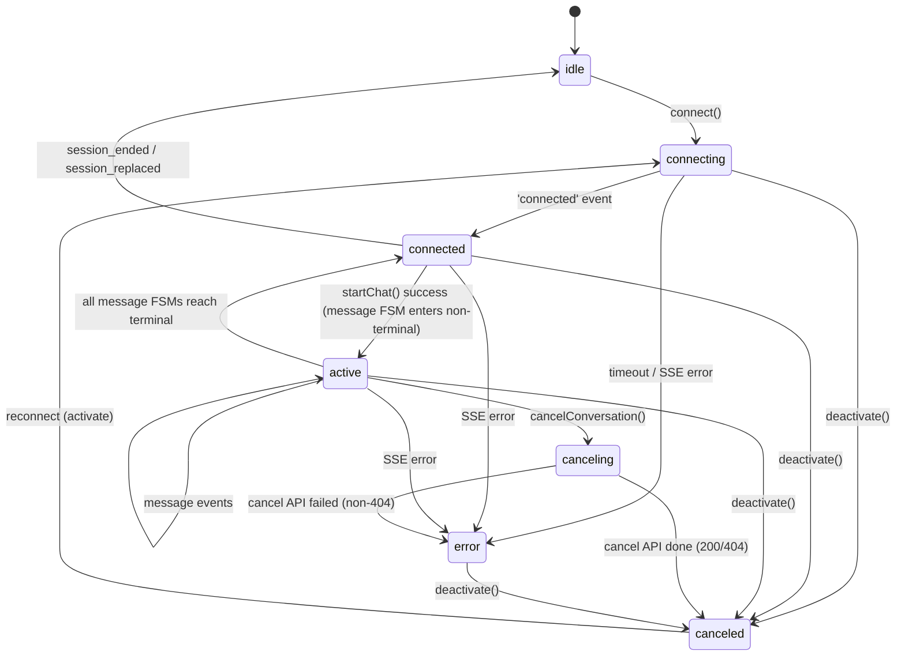

# Chat 前端状态机重构设计

> 日期：2026-03-27
> 状态：已批准

## 背景

当前 chat 前端的会话状态由 `ChatSession` 类管理，消息更新散落在 `ChatStore` 的多个方法中（`appendMessageContent`、`appendMessageEvent`、`addPendingMessages`、`replaceAssistantMessageId`）。这种粗粒度、分散的状态管理导致取消/切换会话时出现竞态问题。

## 设计目标

1. 两层级状态机：会话层（连接生命周期）+ 消息层（消息生命周期）
2. 消息状态不下沉到事件列表被动派生，由状态机主动管理
3. 清晰区分会话级取消 vs 消息级取消
4. 预留多消息扩展（Map 结构），但不实现
5. 与现有 MobX 架构无缝集成

## 方案选择：MobX Observable 状态机

基于现有 MobX 体系，两个层级的状态机都是 MobX observable class。

### 为什么不选 XState

- 引入新依赖，学习曲线
- 与 MobX 的 observable 需要桥接
- 单消息场景有过度设计之嫌

## 1. 会话层状态机 ConversationFSM

会话层 FSM 管理 SSE 连接生命周期，并通过观察 MessageFSM 状态判断是否有活跃消息。消息层的详细状态由消息层 FSM 管理。

### 状态定义

| 状态         | 是否终态 | 含义                                         |
| ------------ | -------- | -------------------------------------------- |
| `idle`       | 否       | 无 SSE 连接，可以发起新 chat                 |
| `connecting` | 否       | SSE 连接建立中（新建或重连共用）             |
| `connected`  | 否       | SSE 已连接，无活跃消息                       |
| `active`     | 否       | SSE 已连接，至少有一个 MessageFSM 处于非终态 |
| `canceling`  | 否       | 取消 API 请求在飞行中                        |
| `error`      | 否       | 不可恢复的连接/启动错误                      |
| `canceled`   | 否       | 已取消（主动取消或切换会话静默取消）         |

`canceled` 和 `error` 可通过 `reconnect` 或 `activate` 回到 `connecting`。

`connected` 与 `active` 的区别：`connected` 表示 SSE 在线但没有活跃消息（刚连上 / 消息处理完了），`active` 表示至少有一个 MessageFSM 处于非终态。只有 `active` 状态下才能发起取消。

### 状态转换图



### connected ↔ active 的驱动方式

- `connected → active`：MessageFSM 创建并进入 `loading`/`streaming` 时，通知 ConversationFSM 转入 `active`
- `active → connected`：最后一个 MessageFSM 到达终态时，ConversationFSM 回到 `connected`

```typescript
// MessageFSM 通知 ConversationFSM
private onMessagePhaseChange(msgId: string, phase: MessagePhase): void {
  const hasActive = Array.from(this.messageFSMs.values())
    .some(fsm => !fsm.isTerminal);

  if (hasActive && this.phase === 'connected') {
    this.transition('active');
  } else if (!hasActive && this.phase === 'active') {
    this.transition('connected');
  }
}
```

### deactivate() 语义

`deactivate()` 是切换会话时的唯一调用点，内部根据当前 phase 决定行为：

| 当前 phase                              | 行为                                                           |
| --------------------------------------- | -------------------------------------------------------------- |
| `idle`                                  | 静默关闭 SSE（如果有的话）                                     |
| `connecting/connected/active/canceling` | phase → canceled，关闭 SSE，通知所有活跃 MessageFSM → canceled |
| `error/canceled`                        | 静默关闭 SSE                                                   |

### 重连流程

```
activateConversation(id)
  → GET /api/chat/session/:id
  → null/done → 保持 idle
  → waiting/running → connect() → connecting → connected
```

重连只建立 SSE 连接（`GET /api/chat/sse/:id`），不发起 agent 执行。

### Computed 属性

```typescript
get hasActiveMessage(): boolean  // phase === 'active'
get canStartChat(): boolean      // idle
```

### 核心接口

```typescript
interface ConversationFSMOptions {
  conversationId: string;
  onSSEEvent: (msg: SSEMessage) => void;
  onError: (error: string) => void;
}

class ConversationFSM {
  phase: ConversationPhase;
  eventSource: EventSource | null;
  private messageFSMs: Map<string, MessageFSM>;

  connect(): Promise<void>;
  deactivate(): void;
  cancelConversation(): Promise<void>;
  addMessageFSM(msgId: string, fsm: MessageFSM): void;
  removeMessageFSM(msgId: string): void;
  getMessageFSM(messageId: string): MessageFSM | undefined;
}
```

## 2. 消息层状态机 MessageFSM

管理单条流式助手消息的完整生命周期。

### 状态定义

| 状态             | 是否终态 | 含义                                            |
| ---------------- | -------- | ----------------------------------------------- |
| `placeholder`    | 否       | 临时消息，无真实 ID，等待 startChat             |
| `loading`        | 否       | startChat API 成功，SSE 已连接，等待 agent 开始 |
| `streaming`      | 否       | 正在接收流式事件                                |
| `awaiting_input` | 否       | Agent 等待用户输入                              |
| `submitting`     | 否       | submitHumanInput API 飞行中                     |
| `canceling`      | 否       | 取消 API 飞行中                                 |
| `final`          | 是       | 正常完成                                        |
| `canceled`       | 是       | 已取消                                          |
| `error`          | 是       | 错误                                            |

### 状态转换图



```mermaid
stateDiagram-v2
    [*] --> placeholder: addPendingMessages()

    placeholder --> loading: startChat() success
    placeholder --> error: startChat() failed

    loading --> streaming: first agent event
    loading --> canceling: cancel()
    loading --> error: SSE lost

    streaming --> streaming: stream/thought/tool/tool events
    streaming --> awaiting_input: tool_progress status=awaiting_input
    streaming --> final: 'final' event
    streaming --> canceled: backend 'cancelled' event
    streaming --> error: backend 'error' event / SSE lost

    awaiting_input --> submitting: submitHumanInput() called
    submitting --> streaming: API success
    submitting --> error: API failed / timeout
    submitting --> canceled: backend 'cancelled' event

    canceling --> canceled: cancel API success/404
    canceling --> error: cancel API failed (non-404)

    final --> [*]: side effect: refreshMessages()
    canceled --> [*]: side effect: refreshMessages()
    error --> [*]: side effect: refreshMessages()
```

### API in-flight 失败处理

| 场景             | 当前状态     | API 失败 | 转入       | 说明                              |
| ---------------- | ------------ | -------- | ---------- | --------------------------------- |
| 取消消息         | `canceling`  | 非 404   | `error`    | 取消失败，消息状态不一致          |
| 取消消息         | `canceling`  | 404      | `canceled` | 后端 session 已不存在，视为已取消 |
| 提交 human input | `submitting` | 任意     | `error`    | 致命——用户输入丢失                |

### 刷新是终态的衍生动作

收到 `final` event → 直接进入 `final`。刷新消息列表是 `final`/`canceled`/`error` 的 onEnter side-effect，不影响状态机流转。这避免了引用替换问题：刷新发生时 MessageFSM 已在终态，不会再修改旧消息对象。

### Computed 属性

```typescript
get isInProgress(): boolean    // 非 final/canceled/error
get isTerminal(): boolean      // final/canceled/error
get canCancel(): boolean       // loading/streaming/awaiting_input
get canSubmitInput(): boolean  // awaiting_input
get isSubmitting(): boolean    // submitting
```

### 核心接口

```typescript
class MessageFSM {
  phase: MessagePhase;
  private message: Message; // 引用 conversationStore.messages 中的消息对象
  awaitingInputSchema: SchemaProperty | null;

  handleEvent(event: AgentEvent): void;
  cancel(): void;
  close(): void; // 静默关闭（切换会话），不发 API
  replaceMessageId(newId: string): void; // placeholder → 真实 ID
}
```

## 3. 取消语义

### 会话级取消 vs 消息级取消

| 维度     | 会话级 `cancelConversation()`           | 消息级 `cancelMessage(id)`              |
| -------- | --------------------------------------- | --------------------------------------- |
| 触发     | 切换会话 / 用户点击取消（单消息下等价） | 多消息下单独取消某条                    |
| SSE      | 关闭                                    | 不关闭（其他消息可能还需要）            |
| 后端 API | 调用 `/cancel`                          | 未来多消息下可能需要 per-message cancel |
| 其他消息 | 全部 cancel                             | 不影响                                  |

当前单消息场景下，用户点击取消 = `cancelConversation()`。

### 切换会话（静默取消）流程

```
deactivate() 调用
  → ConversationFSM: phase → canceled, close SSE
  → 所有活跃 MessageFSM: close() → phase → canceled
  → 不发取消 API，允许后端继续运行
```

## 4. 整体架构

### 文件结构

```
src/client/store/modules/
├── chat.ts                    # ChatStore (精简为薄层)
├── ConversationFSM.ts         # 会话层状态机 (替换 ChatSession.ts)
└── MessageFSM.ts              # 消息层状态机 (新增)
```

### 数据流

```
Components
    │
    ▼
ChatStore (薄层入口)
    │ creates & holds
    ▼
ConversationFSM (连接生命周期)
    │ holds Map<msgId, MessageFSM>
    │ SSE event dispatch
    ▼
MessageFSM (消息生命周期)
    │ 直接修改
    ▼
Message object (in conversationStore.messages)
```

### ChatStore 职责（精简后）

- 持有 `Map<conversationId, ConversationFSM>`
- 监听 conversationId 变化，驱动 `deactivate` / `activate`
- 暴露公共方法：`startChat()`, `cancelConversation()`, `activateConversation()`
- 创建占位消息 → 创建 MessageFSM

### 消息内容修改

MessageFSM 持有对 `conversationStore.messages[conversationId]` 中对应消息对象的引用，直接修改 `content` 和 `meta.events`。MobX 的 `makeAutoObservable` 递归观测嵌套对象，组件能自动响应变化。

## 5. 组件变化

| 组件                     | 当前                                                          | 新设计                                  |
| ------------------------ | ------------------------------------------------------------- | --------------------------------------- |
| `Chat/index.tsx`         | `deriveMessageState(lastMessage).isTerminated` 判断 isLoading | `ConversationFSM.hasActiveMessage`      |
| `AssistantMessage.tsx`   | `showBubbleLoading && chatStore.currentSession?.isLoading`    | `MessageFSM.phase`                      |
| `UniversalEventRenderer` | `detectAwaitingInputRecursive(events)`                        | `MessageFSM.phase === 'awaiting_input'` |
| `HumanInputForm`         | 从 events 提取 schema                                         | `MessageFSM.awaitingInputSchema`        |

### deriveMessageState 的保留

`deriveMessageState` 保留，用于历史消息（无 FSM）的渲染状态派生（`toolCallTimeline`、`thoughts` 等）。流式消息优先使用 MessageFSM 状态。
