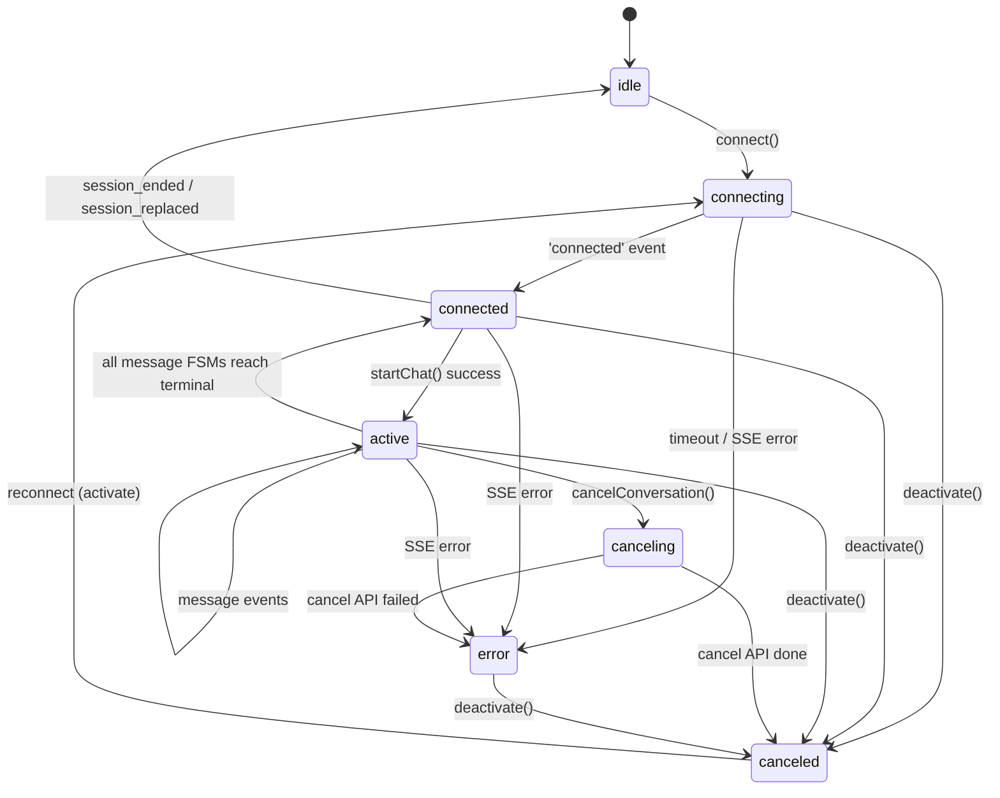
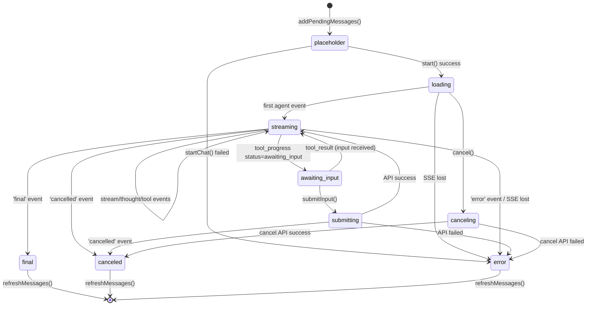

# Chat 前端状态机重构设计

> 日期：2026-03-28
> 状态：已批准
> 更新：重构为同步状态机 + 单一 onTransition 回调

## 设计原则

1. **状态转换是同步事实**：`transition(to): boolean` 永远同步，永远不抛异常。无效转换静默返回 `false`。
2. **副作用归属触发源**：方法驱动的副作用（`connect`、`cancel`、`deactivate`）留在方法体内；事件数据驱动的副作用（内容追加、事件累积、`awaitingInputData` 提取）留在 `handleEvent` 中。
3. **单一 `onTransition(from, to)` 回调**：替代所有 per-state onEnter/onExit 钩子。ConversationFSM 通过此回调同步 phase（`connected ↔ active`）。
4. **MessageFSM 是事件数据变更的唯一入口**：ChatStore 不再直接修改消息 content 或 events，所有变更由 MessageFSM 的 `applyEvent` 完成。
5. **无异步转换，无异常**：状态转换只记录状态事实，不包含任何 I/O 或可能失败的操作。

## 背景

早期 chat 前端的会话状态由 `ChatSession` 类管理，消息更新散落在 `ChatStore` 的多个方法中。这种粗粒度、分散的状态管理导致取消/切换会话时出现竞态问题。

此外，当前 `handleEvent` 直接操作最后一条消息，无法区分事件归属，不支持多消息并行。

## 设计目标

1. 两层级状态机：会话层（连接生命周期）+ 消息层（消息生命周期）
2. 消息状态不下沉到事件列表被动派生，由状态机主动管理
3. 清晰区分会话级取消 vs 消息级取消
4. 支持多消息并行执行，事件精确路由到对应消息
5. 与现有 MobX 架构无缝集成

## 分层概念

```
┌─────────────────────────────────────────────────────────────┐
│                    ConversationFSM                           │
│  会话层：管理 SSE 连接生命周期，聚合消息状态                  │
│  phase: idle | connecting | connected | active | ...         │
└─────────────────────────────────────────────────────────────┘
                              │
                              │ Map<messageId, MessageFSM>
                              ▼
┌─────────────────────────────────────────────────────────────┐
│                      MessageFSM                              │
│  消息层：管理单条消息的生命周期                               │
│  phase: placeholder | loading | streaming | ...              │
│  持有：Message 对象引用                                       │
└─────────────────────────────────────────────────────────────┘
```

前端不持有 ExecutionContext，它仅存在于后端。前端通过 SSE 事件和 API 调用与后端交互。

## 0. 共享 StateMachine

`StateMachine<TPhase>` 是通用的同步状态机，位于 `src/shared/utils/StateMachine.ts`，供 MessageFSM 和 ConversationFSM 共用。

### 接口定义

```typescript
interface StateMachineOptions<TPhase extends string> {
  initialPhase: TPhase;
  transitions: Record<TPhase, TPhase[]>;
  onTransition?: (from: TPhase, to: TPhase) => void;
}

class StateMachine<TPhase extends string> {
  phase: TPhase;
  canTransitionTo(to: TPhase): boolean;
  transition(to: TPhase): boolean; // 同步，触发 onTransition 回调
  silentTransition(to: TPhase): boolean; // 同步，不触发回调（用于历史回放）
}
```

### 关键行为

- `transition(to)`：检查转换合法性，合法则更新 `phase` 并调用 `onTransition`，返回 `true`；非法直接返回 `false`。
- `silentTransition(to)`：同上但不触发 `onTransition`，用于 `replayEvents` 重放历史消息。
- 不抛异常，不异步。

## 1. 会话层状态机 ConversationFSM

会话层 FSM 管理 SSE 连接生命周期，并通过观察 MessageFSM 状态判断是否有活跃消息。

内部使用 `StateMachine<ConversationPhase>` 驱动状态。

### 状态定义

| 状态         | 是否终态 | 含义                                         |
| ------------ | -------- | -------------------------------------------- |
| `idle`       | 否       | 无 SSE 连接，可以发起新 chat                 |
| `connecting` | 否       | SSE 连接建立中（新建或重连共用）             |
| `connected`  | 否       | SSE 已连接，无活跃消息                       |
| `active`     | 否       | SSE 已连接，至少有一个 MessageFSM 处于非终态 |
| `canceling`  | 否       | 取消 API 请求在飞行中（会话级）              |
| `error`      | 否       | 不可恢复的连接/启动错误                      |
| `canceled`   | 否       | 已取消（主动取消或切换会话静默取消）         |

`connected` 与 `active` 的区别：`connected` 表示 SSE 在线但没有活跃消息，`active` 表示至少有一个 MessageFSM 处于非终态。

### 状态转换图



### 核心接口

```typescript
class ConversationFSM {
  phase: ConversationPhase;
  eventSource: EventSource | null;
  private messageFSMs: Map<string, MessageFSM>;

  connect(): Promise<void>;
  deactivate(): void;
  cancelConversation(sendCancelApi: () => Promise<void>): Promise<void>;
  addMessageFSM(msgId: string, message: Message): MessageFSM;
  getOrCreateMessageFSM(message: Message): MessageFSM;
  getMessageFSM(messageId: string): MessageFSM | undefined;
  removeMessageFSM(msgId: string): void;
}
```

### Phase 同步规则（通过 onTransition 回调）

ConversationFSM 不使用 per-state onEnter/onExit 钩子，而是通过给每个 MessageFSM 传入统一的 `onTransition` 回调来同步会话级 phase：

```typescript
private createMessageOnTransition() {
  return (_from: MessagePhase, to: MessagePhase) => {
    if (TERMINAL_MESSAGE_PHASES.includes(to)) {
      this.onMessageTerminal();
    } else if (to === 'loading' || to === 'streaming') {
      this.onMessageActive();
    }
  };
}

private onMessageActive(): void {
  if (this.phase === 'connected') {
    this.sm.transition('active');
  }
}

private onMessageTerminal(): void {
  const hasActive = Array.from(this.messageFSMs.values()).some(
    fsm => !fsm.isTerminated,
  );
  if (!hasActive && this.phase === 'active') {
    this.sm.transition('connected');
  } else if (!hasActive && this.phase === 'canceling') {
    this.sm.transition('canceled');
  }
}
```

- 任一 MessageFSM 进入非终态（`loading` / `streaming`）→ `connected → active`
- 所有 MessageFSM 到达终态 → `active → connected`

### 事件路由

SSE 事件携带 `messageId`，ConversationFSM 根据该字段路由到对应的 MessageFSM：

```typescript
private handleEvent(event: AgentEvent): void {
  const messageId = (event as any).messageId as string | undefined;
  if (messageId) {
    const messageFSM = this.messageFSMs.get(messageId);
    if (messageFSM) {
      messageFSM.handleEvent(event);
    } else {
      console.warn(`MessageFSM not found for ${messageId}`);
    }
  } else {
    const activeFsm = this.getFirstActiveFSM();
    if (activeFsm) activeFsm.handleEvent(event);
  }
}
```

## 2. 消息层状态机 MessageFSM

管理单条流式助手消息的完整生命周期。

内部使用 `StateMachine<MessagePhase>` 驱动状态。

### 状态定义

| 状态             | 是否终态 | 含义                                            |
| ---------------- | -------- | ----------------------------------------------- |
| `placeholder`    | 否       | 临时消息，无真实 ID，等待 startChat             |
| `loading`        | 否       | startChat API 成功，SSE 已连接，等待 agent 开始 |
| `streaming`      | 否       | 正在接收流式事件                                |
| `awaiting_input` | 否       | Agent 等待用户输入                              |
| `submitting`     | 否       | submitHumanInput API 飞行中                     |
| `canceling`      | 否       | 取消 API 飞行中（消息级）                       |
| `final`          | 是       | 正常完成                                        |
| `canceled`       | 是       | 已取消                                          |
| `error`          | 是       | 错误                                            |

### 状态转换图



### 核心接口

```typescript
interface MessageFSMOptions {
  onTransition?: (from: MessagePhase, to: MessagePhase) => void;
}

class MessageFSM {
  phase: MessagePhase;
  readonly messageId: string;

  // 事件数据变更（唯一入口）
  handleEvent(event: AgentEvent): void;

  // 同步状态操作
  start(): boolean;
  submitInput(): boolean;
  cancel(): void;
  close(): void;

  // 工具方法
  replaceMessageId(newId: string): void;
  setMessage(message: Message): void;
}
```

### 事件处理流程

`handleEvent` 是事件数据变更的唯一入口，分两步：

1. **`applyEvent(event)`**：根据事件类型执行数据变更
   - `stream` → 追加 `message.content`
   - `thought` / `tool_call` / `tool_result` / `tool_error` / `cancelled` / `error` → 追加到 `message.meta.events`
   - `tool_progress` → 追加 event + 提取 `awaitingInputData`
2. **`resolveTargetPhase(event)` → `transition(target)`**：根据事件类型和当前 phase 确定目标状态并同步转换

```typescript
handleEvent(event: AgentEvent): void {
  if (this.isTerminated) return;
  this.applyEvent(event);
  const target = this.resolveTargetPhase(event);
  if (target) this.sm.transition(target);
}
```

### awaitingInputData 管理

`awaitingInputData` 是 MessageFSM 的直接字段，由 `applyEvent` 在处理 `tool_progress` 事件时设置。当 `onTransition` 回调检测到 `from === 'awaiting_input'` 时自动清除：

```typescript
this.sm = new StateMachine({
  initialPhase: 'placeholder',
  transitions: DEFAULT_TRANSITIONS,
  onTransition: (from, to) => {
    if (from === 'awaiting_input') this._awaitingInputData = null;
    options?.onTransition?.(from, to);
  },
});
```

### 历史消息回放

历史消息通过 `fromMessage` 工厂方法初始化，使用 `silentTransition` 只计算状态，不触发副作用：

```typescript
static fromMessage(msg: Message, options?: MessageFSMOptions): MessageFSM {
  const fsm = new MessageFSM(msg.id, msg, options);
  fsm.replayEvents(msg.meta?.events ?? []);
  return fsm;
}

private replayEvents(events: AgentEvent[]): void {
  if (events.length === 0) return;
  this.sm.silentTransition('loading');
  for (const event of events) {
    const target = this.resolveTargetPhase(event);
    if (target) this.sm.silentTransition(target);
    if (event.type === 'tool_progress') {
      this.handleAwaitingInput(event);
    }
  }
}
```

## 3. 取消语义

### 会话级取消 vs 消息级取消

| 维度     | 会话级 `cancelConversation()`  | 消息级 `cancelMessage(id)`            |
| -------- | ------------------------------ | ------------------------------------- |
| 触发     | 切换会话 / 用户点击取消        | 多消息下单独取消某条                  |
| SSE      | 关闭                           | 不关闭                                |
| 后端 API | `POST /cancel/:conversationId` | `POST /cancel/:conversationId/:msgId` |
| 其他消息 | 全部 cancel                    | 不影响                                |

### 消息级取消流程

```
用户点击单条消息的取消按钮
  → ConversationFSM.cancelMessage(msgId)
  → POST /api/chat/cancel/:conversationId/:msgId
  → 后端: MessageFSM.cancel() → ctx.abort()
  → SSE 收到 cancelled 事件（带 messageId）
  → 前端: 对应 MessageFSM → canceled
  → ConversationFSM: 若还有其他活跃消息则保持 active
```

## 4. 整体架构

### 数据流

```
Components
    │
    ▼
ChatStore (薄层入口)
    │ creates & holds
    ▼
ConversationFSM (连接生命周期)
    │ holds Map<msgId, MessageFSM>
    │ SSE event dispatch by messageId
    ▼
MessageFSM (消息生命周期 + 唯一数据变更入口)
    │ 直接修改
    ▼
Message object (in conversationStore.messages)
```

### ChatStore 职责

- 持有 `Map<conversationId, ConversationFSM>`
- 监听 conversationId 变化，驱动 `deactivate` / `activate`
- 暴露公共方法：`startChat()`, `cancelChat()`, `submitHumanInput()`, `activateConversation()`
- 创建占位消息 → 创建 MessageFSM
- `handleEvent` 仅作为安全守卫（检查 conversationId 是否匹配当前会话），不再直接修改消息内容

### 消息内容修改

MessageFSM 持有对 `conversationStore.messages[conversationId]` 中对应消息对象的引用，`handleEvent` → `applyEvent` 是修改 `content` 和 `meta.events` 的唯一路径。ChatStore 不再拥有 `appendMessageContent` 或 `appendMessageEvent` 方法。MobX 的 `makeAutoObservable` 递归观测嵌套对象，组件能自动响应变化。

## 5. 组件变化

| 组件                     | 变化                                                                        |
| ------------------------ | --------------------------------------------------------------------------- |
| `AssistantMessage.tsx`   | 统一从 `MessageFSM` 读取 `content`、`events`、`phase` 等                    |
| `Chat/index.tsx`         | 从 `ConversationFSM` 读取会话状态，`MessageFSM.isTerminated` 判断 isLoading |
| `UniversalEventRenderer` | 使用 `MessageFSM.toolCallTimeline`、`MessageFSM.thoughts`                   |
| `HumanInputForm`         | 使用 `MessageFSM.awaitingInput`                                             |

## 6. AgentEvent 增加 messageId

所有 AgentEvent 变体增加 `messageId` 字段，用于前端事件路由：

```typescript
export type AgentEvent =
  | { type: 'start'; messageId: string; seq: number; at: number }
  | {
      type: 'thought';
      messageId: string;
      content: string;
      seq: number;
      at: number;
    }
  | {
      type: 'stream';
      messageId: string;
      content: string;
      seq: number;
      at: number;
    }
  | {
      type: 'tool_call';
      messageId: string;
      callId: string;
      toolName: string;
      toolArgs: Record<string, unknown>;
      seq: number;
      at: number;
    }
  | {
      type: 'tool_progress';
      messageId: string;
      callId: string;
      toolName: string;
      data: unknown;
      seq: number;
      at: number;
    }
  | {
      type: 'tool_result';
      messageId: string;
      callId: string;
      toolName: string;
      output: unknown;
      seq: number;
      at: number;
    }
  | {
      type: 'tool_error';
      messageId: string;
      callId: string;
      toolName: string;
      error: string;
      seq: number;
      at: number;
    }
  | { type: 'final'; messageId: string; seq: number; at: number }
  | {
      type: 'cancelled';
      messageId: string;
      reason: string;
      seq: number;
      at: number;
    }
  | {
      type: 'error';
      messageId: string;
      error: string;
      seq: number;
      at: number;
    };
```

## 7. 文件结构

```
src/shared/utils/
└── StateMachine.ts             # 通用同步状态机

src/client/store/modules/
├── chat.ts                    # ChatStore (薄层入口)
├── ConversationFSM.ts         # 会话层状态机
└── MessageFSM.ts              # 消息层状态机
```
